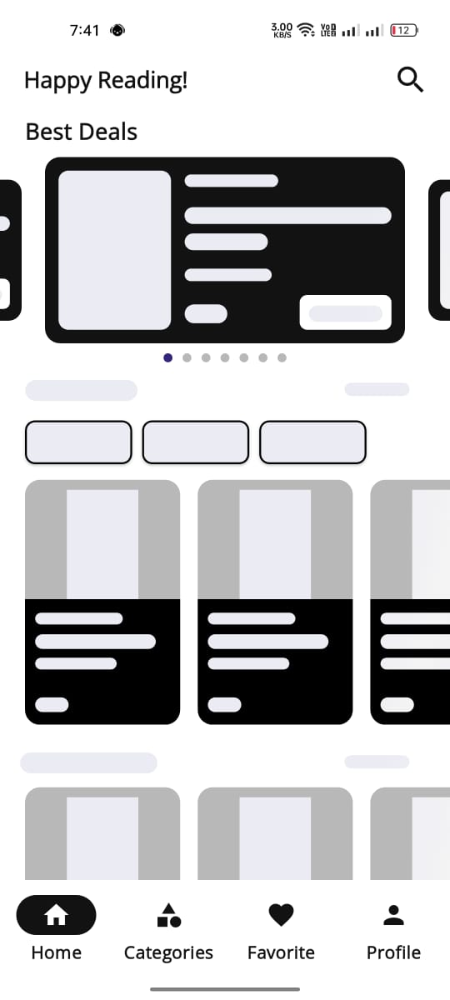

# 📚 Free Books App


A Flutter application for browsing and reading free books using the **Google Books API**. The app offers a smooth and intuitive user experience with a modern UI design.

## ✨ Features

- 📖 Browse free books from various categories
- 🏷️ View best deals and top books
- ❤️ Add books to favorites
- 🔍 **Search and filtering (Coming Soon...)**
- 🔐 User authentication using **Firebase Authentication**
- 🚀 Optimized performance with caching and state management

## 🛠️ Technologies Used

- **State Management**: `flutter_bloc`
- **Networking**: `dio`
- **Database**: `cloud_firestore`
- **Caching**: `cached_network_image`
- **Navigation**: `go_router`
- **UI Components**: `carousel_slider`, `skeletonizer`, `smooth_page_indicator`
- **Authentication**: `firebase_auth`
- **Local Storage**: `shared_preferences`
- **Environment Variables**: `flutter_dotenv`
- **Deep Linking & External URLs**: `url_launcher`

## 📷 Screenshots
<p align="center">
  
  
</p>

---

<p align="center">
  
  
</p>

---

## 🚀 Getting Started

1. Clone the repository:
   ```sh
   git clone https://github.com/yourusername/free-books-app.git
   ```
2. Navigate to the project directory:
   ```sh
   cd free-books-app
   ```
3. Install dependencies:
   ```sh
   flutter pub get
   ```
4. Run the app:
   ```sh
   flutter run
   ```

---

## 🔐 Firebase Authentication Setup

To enable authentication:
1. Set up a Firebase project.
2. Enable **Email/Password Authentication** in Firebase Console.
3. Add your `google-services.json` (Android) or `GoogleService-Info.plist` (iOS) to the project.
4. Configure Firebase in your Flutter app.

---

## 📌 Future Improvements

- 🔍 Implement search functionality
- 🎯 Add filtering options
- 📢 Push notifications for new books

---

## Contact 📞

Have questions or suggestions? Feel free to reach out to me!  

- **Email**: [eng.abdelazim3@gmail.com](eng.abdelazim3@gmail.com)  
- **LinkedIn**: [Abdelazim Ramadan](https://www.linkedin.com/in/azimramadan?utm_source=share&utm_campaign=share_via&utm_content=profile&utm_medium=android_app)  
- **Facebook**: [عبدالعظيم رمضان](https://www.facebook.com/share/19pSykEJNM/?mibextid=qi2Omg)  

---

*Thank you for checking out this project! Feel free to contribute and share your thoughts.* 😊📚
